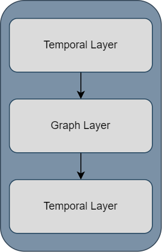

This section describes the functionality of temporal graph layers provided by the framework.

## General information

Temporal layers are based and adapted from the paper of [Spatio-Temporal Graph Convolutional Networks](https://www.ijcai.org/proceedings/2018/0505.pdf)
and extended to work with different temporal and graph layers. Generally, each _spatio-temporal-block_ consists of 3
layers as seen here.

Temporal layers can be either of the following TF/Keras layers:

- [Conv2D](https://www.tensorflow.org/api_docs/python/tf/keras/layers/Conv2D)
- [LSTM](https://www.tensorflow.org/api_docs/python/tf/keras/layers/LSTM)
- [GRU](https://www.tensorflow.org/api_docs/python/tf/keras/layers/GRU)
- [ConvLSTM2D](https://www.tensorflow.org/api_docs/python/tf/keras/layers/ConvLSTM2D)

Graph layers can be either of:

- [GraphBase](../../layers/static_layers#gog.layers.base.GraphBase)
- [GraphConvolution](../../layers/static_layers#gog.layers.conv.GraphConvolution)
- [GraphAttention](../../layers/static_layers#gog.layers.attention.GraphAttention)

Spatio-temporal blocks can be stacked and work for graphs that only contain node features, as well as graphs
with both node and edge features.

## Convolutional Spatio-Temporal blocks

Layers that extend the `TemporalConv` layer implement the spatio-temporal block by using 2D-Convolutions as temporal layers.

The first convolution layer receives a sequence of graphs in the dimension _(batch_size, seq_len, n_nodes, embedding_size)_
and outputs the same dimension again. For that, it uses `seq_len` as the filter count, and a 2D kernel of size _(embedding_size, 1)_,
meaning that the node features of each graph are handled sequentially independent of each other. To keep the input dimension,
"same"-padding is applied.

The graph layer receives all graphs in the learned sequence and stacks them to transform their node_features. The output 
dimensions is _(batch_size * seq_len, n_nodes, embedding_size)_.

The second temporal layer works identically to the first, except that the number of filters is determined by the 
hyperparameter `output_seq_len` which determines how many graphs are in the output sequence.

## Recurrent Spatio-Temporal blocks
Layers that extend `GraphLSTM`, `GraphGRU` or `GraphConvLSTM` work slightly differently.

The first recurrent layer operates node-wise, meaning that for each graph in the sequence, it receives
node features of the same node until all nodes are processed. For a sequence of 3 graphs, denoted by node#node
(#graph), it would process nodeA(0), nodeA(1), nodeA(2), nodeB(0),
etc. After processing the whole sequence of the layer is returned.

This sequence is reshaped back into _(batch_size * seq_len, n_nodes, n_node_features)_ for the node features to be 
transformed by the graph layer. The output is again _(batch_size * seq_len, n_nodes, embedding_size)_. 

The second recurrent layer works a bit differently, in that it receives the flattened node feature matrix as input. This
captures the change of all features in the whole graph instead of node-level information. The second recurrent layer 
only returns its last output which is its prediction of the next graph. Since the used recurrent layers, are limited to
single-step predictions out-of-the-box, a dense layer is used to create `output_seq_len` new graphs from the one 
prediction of the recurrent layers.

**NOTE**: The mentioned dimensionalities do not apply to the `GraphConvLSTM` since it uses a 5D input instead of 3D. It 
receives an additional empty channel dimension. Its convolution is configured to work on a single filter only, but
using the same dimensions as described for the `Spatio-Temporal Convolution blocks`.

## Output blocks
Since the procedure of spatio-temporal blocks is unique, the framework provides two output layers:

- [ConvOutputBlock](../../layers/temporal_layers/#gog.layers.temporal.output_layer.ConvOutputBlock) to be used with `Convolutional Spatio-Temporral blocks`
- [RecurrentOutputBlock](../../layers/temporal_layers/#gog.layers.temporal.output_layer.RecurrentOutputBlock) to be used with `Recurrent Spatio-Temporal blocks`

For their exact functionality, check the respective documentations.

## Edge features in spatio-temporal blocks
As shown in the tutorial on [model definition](../model_definition), edge features are fed into each layer manually.
They are used to create a weighted adjacency matrix which in turn strengthens or weakens
the importance of some nodes of a graph. This is also true for the `spatio-temporal blocks`, however there is an 
additional step because of the parameter `output_seq_len`. Since edge features are not part of the output of each block,
their sequence length is constant. Therefore, when stacking layers they are passed through a convolutional layer
to ensure that the sequence length for the edge features is equal to the sequence length of the node features. 